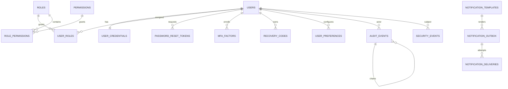

# Data Model

## Scope

This document describes the target relational model for the enterprise portal. Flyway migrations are not yet present, so table names and columns are design-level contracts until implemented.

## Entity relationship overview

## Identity tables

| Table | Purpose | Key columns |
|-------|---------|-------------|
| `users` | Portal identities | `id`, `email`, `display_name`, `status`, `locale`, `timezone`, `created_at`, `updated_at`, `version` |
| `user_credentials` | Password verifier and credential metadata | `user_id`, `password_hash`, `password_changed_at`, `failed_login_count`, `locked_until`, `must_change_password` |
| `password_reset_tokens` | Short-lived password reset requests | `id`, `user_id`, `token_hash`, `expires_at`, `used_at`, `created_ip_hash` |
| `mfa_factors` | Enrolled MFA factors | `id`, `user_id`, `type`, `encrypted_secret`, `key_id`, `enabled_at`, `last_used_at` |
| `recovery_codes` | Hashed one-time MFA recovery codes | `id`, `user_id`, `code_hash`, `used_at`, `created_at` |

Constraints:

- `users.email` is unique after canonicalization.
- Password hashes use Argon2id and never leave `user_credentials`.
- Reset token raw values are shown once and stored only as hashes.
- TOTP secrets are encrypted with an external key and versioned by `key_id`.

## Access-control tables

| Table | Purpose | Key columns |
|-------|---------|-------------|
| `roles` | Named sets of permissions | `id`, `code`, `name`, `description`, `system_role`, `created_at`, `updated_at` |
| `permissions` | Stable permission catalog | `id`, `code`, `module`, `description`, `risk_level` |
| `user_roles` | User-to-role assignments | `user_id`, `role_id`, `assigned_by`, `assigned_at` |
| `role_permissions` | Role-to-permission grants | `role_id`, `permission_id`, `granted_by`, `granted_at` |
| `authorization_versions` | Authority invalidation state | `user_id`, `version`, `changed_at` |

Constraints:

- `roles.code` and `permissions.code` are unique and immutable after creation.
- Reserved system roles cannot be deleted.
- The final active `SUPER_ADMIN` cannot be removed, disabled, or stripped of effective super-admin capability.

## Audit and security-event tables

| Table | Purpose | Key columns |
|-------|---------|-------------|
| `audit_events` | Append-only administrative and security audit trail | `id`, `occurred_at`, `actor_user_id`, `action`, `target_type`, `target_id`, `outcome`, `metadata_json`, `previous_hash`, `current_hash` |
| `audit_integrity_checkpoints` | Periodic verification evidence | `id`, `checked_at`, `first_event_id`, `last_event_id`, `last_hash`, `status`, `details_json` |
| `security_events` | Security detections and account-risk facts | `id`, `occurred_at`, `event_type`, `subject_user_id`, `risk_level`, `source_ip_hash`, `user_agent_hash`, `metadata_json` |
| `rate_limit_events` | Rate-limit state and evidence | `id`, `bucket_key_hash`, `policy`, `window_start`, `attempt_count`, `blocked_until` |

Constraints:

- The application runtime role has `INSERT` and `SELECT` only on `audit_events`; no `UPDATE` or `DELETE`.
- `current_hash` covers canonical event content plus `previous_hash`.
- Metadata must be schema-controlled and redacted.

## Settings and localization tables

| Table | Purpose | Key columns |
|-------|---------|-------------|
| `settings` | Runtime settings | `key`, `value_json`, `scope`, `updated_by`, `updated_at` |
| `user_preferences` | Per-user language, theme, and display settings | `user_id`, `locale`, `direction`, `theme`, `updated_at` |

Defaults:

- Locale: `fa-IR`
- Direction: `rtl`
- Theme: `SYSTEM` unless user selects `LIGHT` or `DARK`

## Notification tables

| Table | Purpose | Key columns |
|-------|---------|-------------|
| `notification_templates` | Localized message templates | `id`, `code`, `locale`, `subject`, `body`, `version`, `active` |
| `notification_outbox` | Durable outgoing notification queue | `id`, `template_code`, `recipient`, `payload_json`, `status`, `available_at`, `created_at` |
| `notification_deliveries` | Delivery attempts | `id`, `outbox_id`, `attempted_at`, `provider`, `status`, `error_code` |

## Operational tables

| Table | Purpose | Key columns |
|-------|---------|-------------|
| `bootstrap_runs` | First-admin and seed-data bootstrap evidence | `id`, `run_type`, `status`, `started_at`, `completed_at`, `details_json` |
| `modulith_events` | Spring Modulith event publication registry | managed by Spring Modulith |

## Data retention notes

- Audit events: retain according to regulatory and business policy; deletion should require offline archival procedures, not runtime mutation.
- Security events: retain long enough to support incident response and abuse investigations.
- Password reset tokens and rate-limit buckets: short retention only.
- Notification payloads: minimize sensitive data and expire old delivery artifacts.
