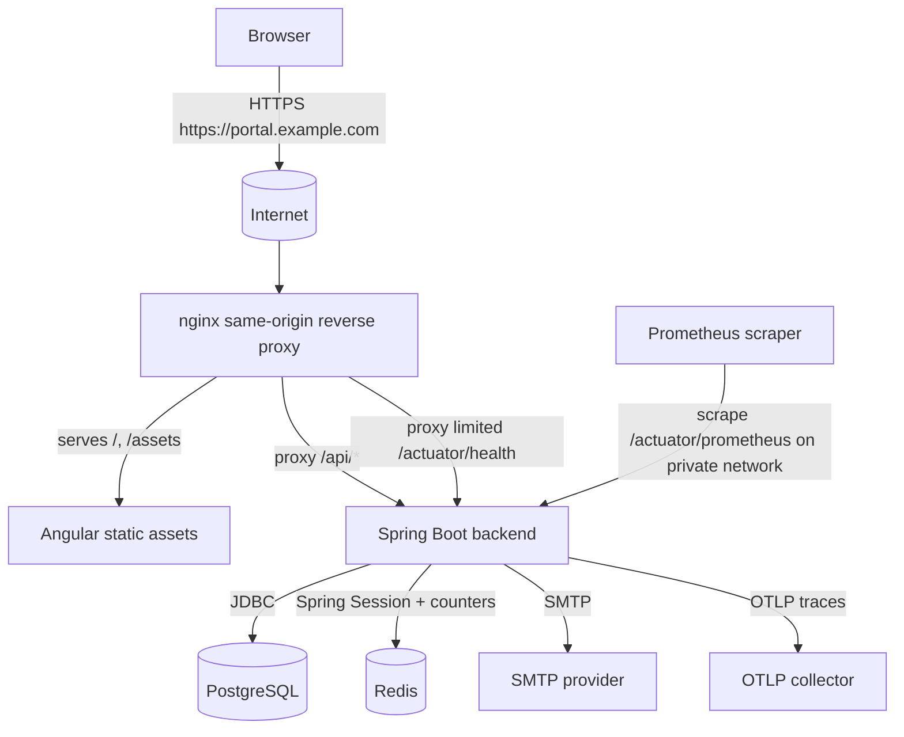
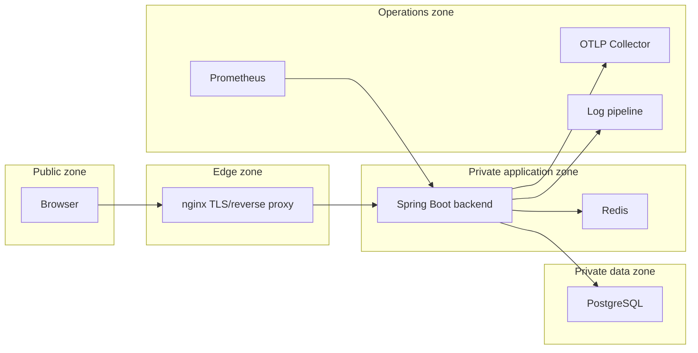

# Deployment Architecture

## Target topology

Production deployment uses a same-origin model: the browser sees one HTTPS origin, nginx serves Angular assets and proxies API calls to the Spring Boot backend. This supports HttpOnly session cookies and CSRF protection without exposing bearer tokens to browser storage.

## Routing model

| Public path | Owner | Notes |
|-------------|-------|-------|
| `/` and static assets | nginx / Angular | Cache hashed assets; do not cache `index.html` aggressively. |
| `/api/**` | Spring Boot | Requires session and CSRF for mutating requests unless explicitly public. |
| `/actuator/health` | Spring Boot | Public or load-balancer visible with minimal details. |
| `/actuator/prometheus` | Spring Boot | Private network only; never internet-exposed. |
| `/v3/api-docs`, `/swagger-ui/**` | Spring Boot | Non-production or admin-restricted only. |

## Cookie requirements

| Cookie | Purpose | Production setting |
|--------|---------|--------------------|
| `PORTALSESSION` | Opaque session identifier | `HttpOnly`, `Secure`, `SameSite=Lax` or stricter if compatible, path `/` |
| `XSRF-TOKEN` | Non-secret CSRF value readable by Angular | `Secure`, not `HttpOnly`, path `/` |

The CSRF value is not an authentication secret. It is paired with the server-side session and submitted in `X-XSRF-TOKEN` for unsafe methods.

## Network zones

## Environment configuration

Required configuration is represented in `.env.example`:

- Database connection and separate migration/runtime credentials.
- Redis host, port, and optional password.
- Session cookie name, idle timeout, and absolute timeout.
- CSRF cookie and header names.
- MFA encryption key ID and Base64 key material supplied by environment or secret manager.
- Bootstrap admin values for one-time initialization.
- OTLP endpoint and actuator exposure.

## Deployment controls

- Terminate TLS at nginx or an approved upstream load balancer.
- Forward `X-Forwarded-Proto`, `X-Forwarded-Host`, and request ID headers safely.
- Enforce maximum request body size and sane timeouts at nginx.
- Disable directory listing and hidden-file serving.
- Add security headers: HSTS, `X-Content-Type-Options`, `Referrer-Policy`, `Content-Security-Policy`, and frame controls.
- Restrict actuator and database access to private networks.
- Run backend and nginx as non-root users where images allow.

## Open implementation items

- Docker Compose and container images are not yet committed.
- nginx config is design-level and must be implemented with environment-specific hostnames.
- TLS certificate automation and secret management are deployment-environment responsibilities.
