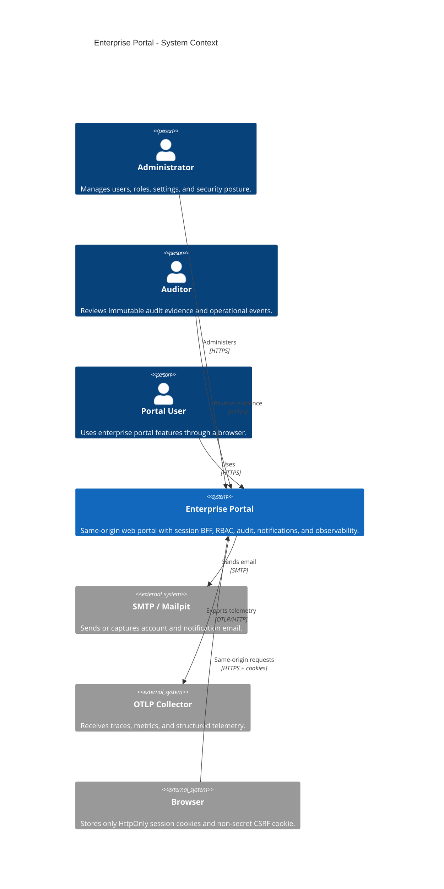
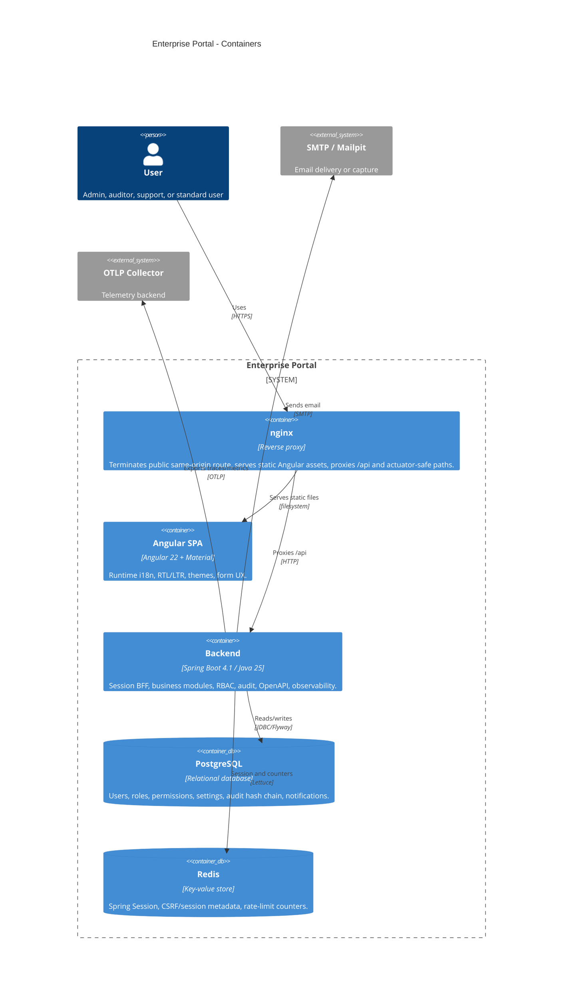
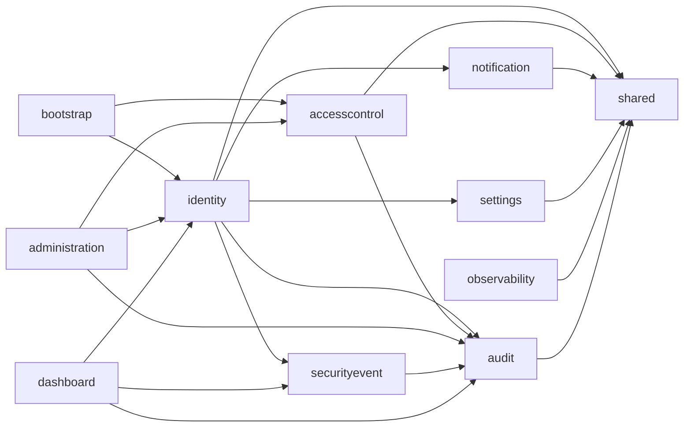

# Architecture Overview

## Purpose

This portal is designed as a secure enterprise administration platform delivered as a **modular monolith**. The runtime is one Spring Boot backend process, one Angular frontend, PostgreSQL for durable state, Redis for sessions and short-lived security state, and observability integrations for metrics, traces, and logs.

The implementation is still in early foundation phases. This document describes the target architecture accepted by the ADRs and should be updated with implementation evidence as modules are built.

## Architectural style

- **Same-origin BFF**: the browser talks to the backend through the same public origin. The backend owns sessions and security decisions.
- **Modular monolith**: business capabilities are separated into Spring Modulith modules with explicit APIs and dependency rules.
- **Permission-based authorization**: endpoints and services check stable permission codes, not role names.
- **Persian-first UX**: `fa-IR` is the default language; RTL is the default direction until a user preference changes it.
- **Evidence-based security**: design documents distinguish planned controls from verified implementation.

## System context

## Containers

## Backend modules

## Key runtime flows

1. Browser loads Angular assets from nginx.
2. Angular calls backend APIs with same-origin credentials.
3. Backend authenticates using a Redis-backed opaque session cookie.
4. Mutating requests require a valid CSRF header matching the CSRF cookie/session token.
5. Authorization is evaluated against session authorities derived from database permissions.
6. Security-relevant state changes write append-only audit events and structured security events.
7. Metrics and traces are exported through Micrometer and OpenTelemetry.

## Main design constraints

- No JWT or bearer token is stored in browser storage.
- CSRF is mandatory for state-changing browser requests.
- Passwords use Argon2id through Spring Security and BouncyCastle.
- TOTP/MFA secrets are encrypted at rest with externally supplied keys.
- Public self-registration is disabled; the first administrator is bootstrapped once through environment variables.
- Administrative and security events must not log passwords, session identifiers, CSRF tokens, reset tokens, or MFA secrets.

## Current implementation evidence

| Area | Evidence | Status |
|------|----------|--------|
| Technology baseline | `docs/architecture/technology-baseline.md`, `backend/pom.xml`, `frontend/package.json` | Drafted |
| Session BFF decision | `docs/decisions/ADR-0002-session-bff-auth.md` | Accepted design |
| RBAC decision | `docs/decisions/ADR-0003-rbac-permissions.md` | Accepted design |
| Audit hash chain decision | `docs/decisions/ADR-0004-audit-hash-chain.md` | Accepted design |
| Backend modules | Spring Modulith dependency present | Implementation pending |
| Docker/nginx deployment | Design documented | Implementation pending |
