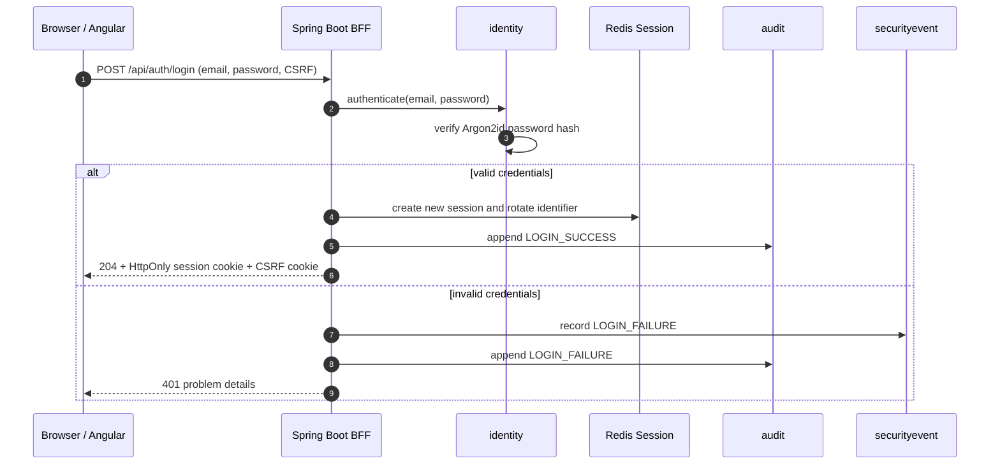
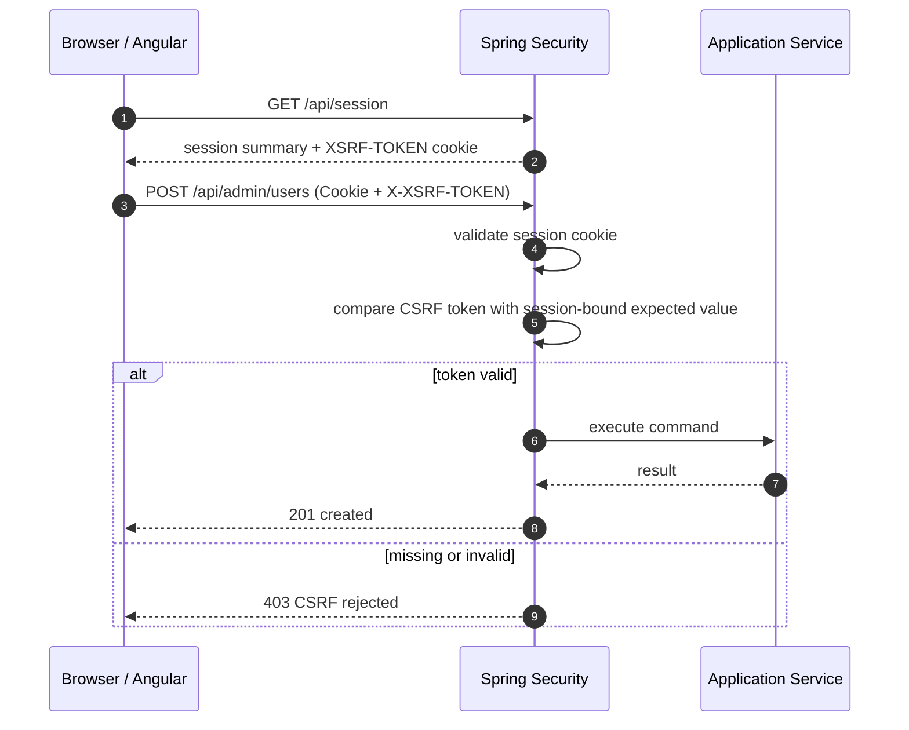
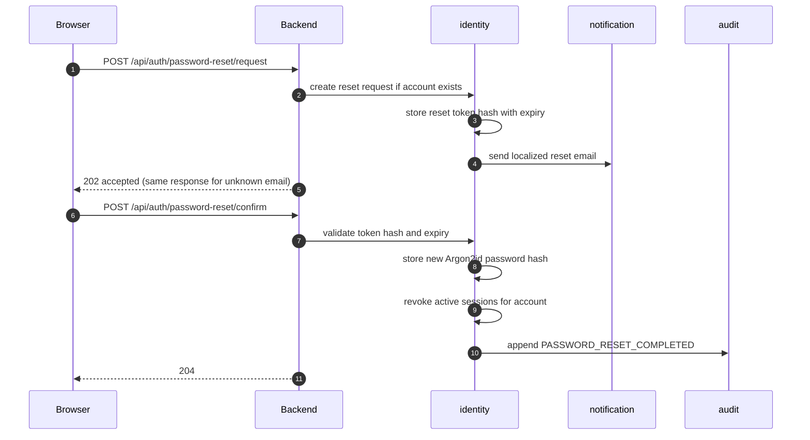
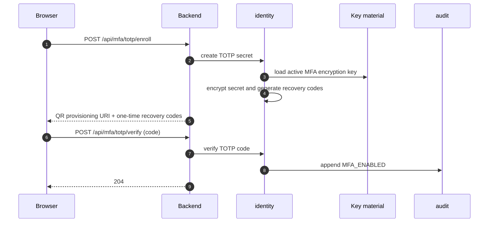
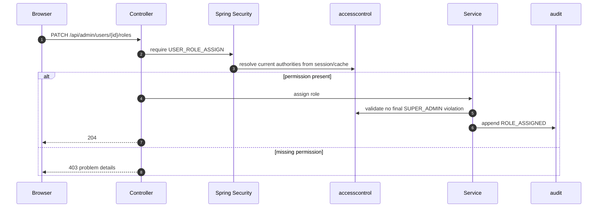
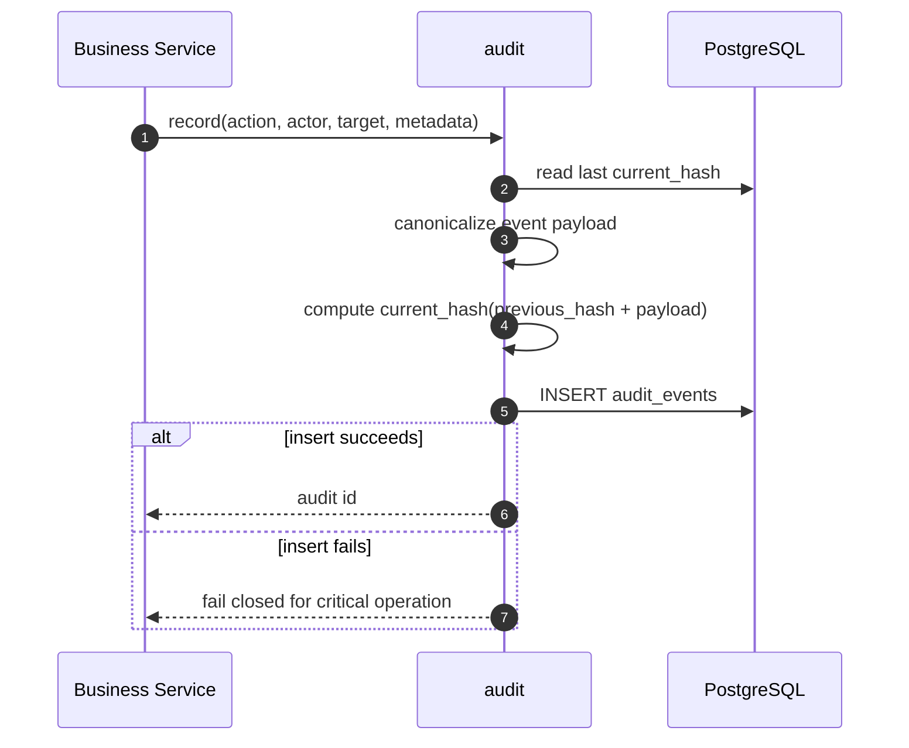
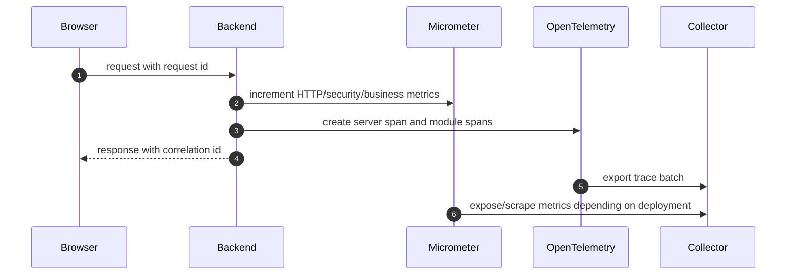
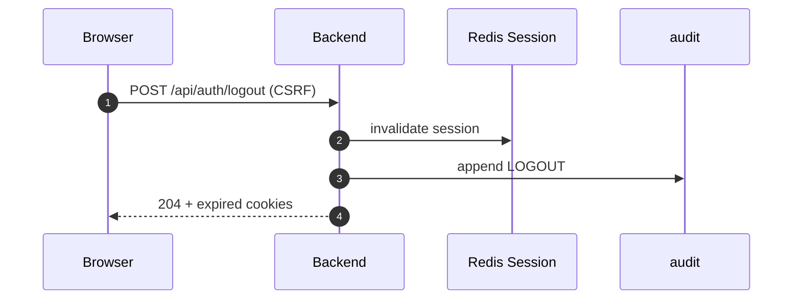

# Architecture Sequences

## Login and session creation

## CSRF-protected mutation

## Password reset

## MFA enrollment and challenge

## RBAC authorization

## Audit append and hash chain

## Telemetry flow

## Logout

