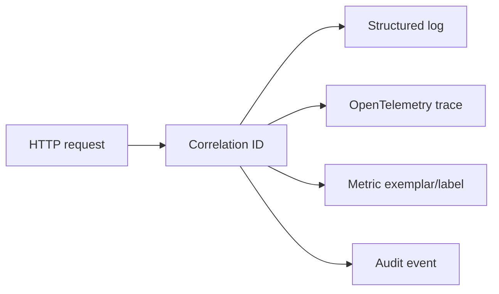

# Logging Design

## Goals

- Make operational issues diagnosable.
- Support security detection without exposing secrets.
- Link logs, traces, metrics, security events, and audit records through correlation IDs.

## Log categories

| Category | Purpose | Retention owner |
|----------|---------|-----------------|
| Application logs | Debugging and operational state | Operations |
| Access logs | Request routing and status | Operations/security |
| Security events | Authentication and account-risk signals | Security |
| Audit events | Tamper-evident accountability | Compliance/security |
| Dependency logs | Database, Redis, SMTP, telemetry client health | Operations |

## Structured fields

Baseline fields:

```json
{
  "timestamp": "ISO-8601",
  "level": "INFO",
  "service": "portal-backend",
  "environment": "production",
  "correlation_id": "request-scoped-id",
  "trace_id": "otel-trace-id",
  "span_id": "otel-span-id",
  "event_type": "LOGIN_FAILURE",
  "outcome": "DENIED"
}
```

Optional fields must be allowlisted. Do not add arbitrary request bodies or headers.

## Redaction

Always redact:

- `password`
- `newPassword`
- cookies and session IDs
- `XSRF-TOKEN` and `X-XSRF-TOKEN`
- reset tokens
- TOTP secrets and provisioning URIs
- recovery codes
- encryption keys

## Correlation



## Logging levels

| Level | Use |
|-------|-----|
| `ERROR` | Failed critical operation, dependency outage, audit persistence failure. |
| `WARN` | Security rejection patterns, degraded dependency, retry exhaustion. |
| `INFO` | Startup, shutdown, configuration summary without secrets, privileged operation summaries. |
| `DEBUG` | Local development only; never include secrets. |

## Evidence to add

- Logback JSON encoder configuration.
- Request correlation filter.
- Redaction tests.
- nginx access log masking configuration.
