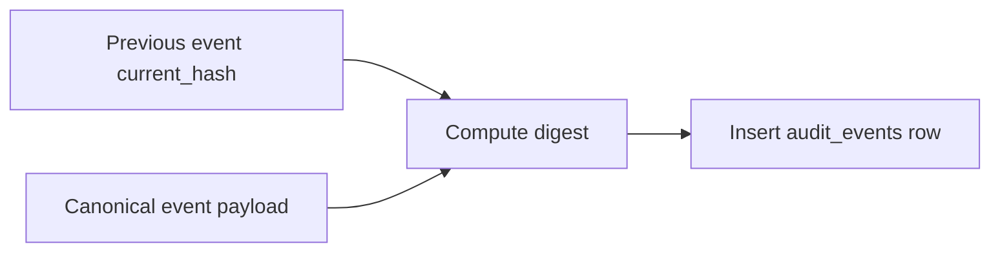

# Audit Integrity Design

## Goals

- Make privileged actions attributable.
- Detect modification, deletion, reordering, or insertion of audit records.
- Fail closed when critical security operations cannot be audited.
- Preserve privacy by recording only necessary metadata.

## Audit event structure

| Field | Purpose |
|-------|---------|
| `id` | Monotonic or sortable event identifier. |
| `occurred_at` | Server-side timestamp. |
| `actor_user_id` | Authenticated actor or system principal. |
| `action` | Stable action code such as `USER_DISABLED`. |
| `target_type` / `target_id` | Affected entity. |
| `outcome` | Success, denied, failed, or system outcome. |
| `correlation_id` | Links request logs, traces, and audit. |
| `metadata_json` | Redacted structured metadata. |
| `previous_hash` | Prior audit event hash. |
| `current_hash` | Hash of canonical current event plus previous hash. |

## Hash-chain process

## Database hardening

- Application runtime user: `INSERT` and `SELECT` only on `audit_events`.
- Migration user: schema changes only during deployment.
- No runtime `UPDATE` or `DELETE` on audit tables.
- Backups must preserve audit rows and verification checkpoints.

## Critical audited operations

- Login success and selected login failures.
- Logout.
- Password reset completion.
- MFA enrollment, disablement, reset, and recovery-code use.
- User create/update/disable/delete/unlock.
- Role assignment/revocation.
- Permission grant changes.
- Security-sensitive setting changes.
- Audit export and integrity verification.
- Bootstrap first-admin creation.

## Integrity verifier

The verifier should:

1. Read events in canonical order.
2. Recompute every `current_hash`.
3. Confirm each `previous_hash` matches the prior event.
4. Store a checkpoint with checked range, last hash, status, and timestamp.
5. Alert on mismatch, gap, unexpected deletion, or query failure.

## Privacy rules

Audit metadata must not include:

- Passwords or password hashes.
- Session identifiers.
- CSRF tokens.
- Reset tokens.
- TOTP secrets.
- Recovery codes.
- Full raw request/response bodies.

## Runtime privilege enforcement

Flyway `V7__audit_append_only_grants.sql` revokes `UPDATE` / `DELETE` / `TRUNCATE` on `audit_events` and `audit_event_chain` from the runtime role (`portal_app`) after V5's broad DML grants, leaving `SELECT` + `INSERT` only.

## Verification evidence

| Check | Command / artifact |
|-------|--------------------|
| Runtime role lacks UPDATE/DELETE | `infrastructure/scripts/audit-db-verify.sh` (`has_table_privilege`) |
| Hash fields populated | `audit-db-verify.sh` + `LiveSecurityIntegrationTest` |
| API integrity verify | `POST /api/v1/audit-events/verify-integrity` in `live-api-verify.sh` |
| Unit hash-chain math | `AuditHashChainTest` |
| CI live evidence | `fullstack-verify` artifact `live-stack-evidence/audit-integrity.txt` |

## Limitations

The hash chain detects tampering but does not itself prevent privileged database administrators from modifying both data and hashes. Production assurance also requires restricted database administration, immutable backups, monitoring, and separation of duties.
