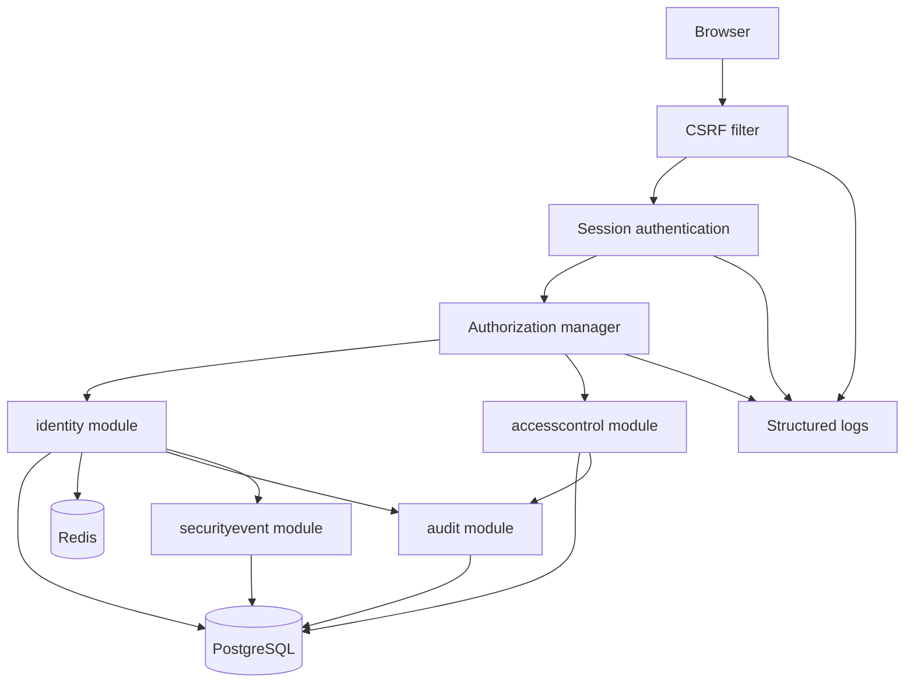

# Security Architecture

## Security goals

- Protect administrative capabilities with deny-by-default, permission-based authorization.
- Keep authentication tokens out of browser storage.
- Make privileged activity attributable and tamper-evident.
- Minimize sensitive data exposure in logs, telemetry, notifications, and APIs.
- Support Persian-first (`fa-IR`) localized UX without weakening validation or encoding.

## Control layers

| Layer | Controls |
|-------|----------|
| Browser | No JWT/localStorage tokens, Angular CSRF header integration, output encoding, CSP-compatible frontend design |
| Edge/nginx | TLS, HSTS, request size limits, same-origin routing, static asset caching, actuator restrictions |
| Spring Security | Session authentication, CSRF, authorization filters, method security, password hashing |
| Domain modules | Invariant checks, final `SUPER_ADMIN` protection, audit-on-change, sanitized events |
| Data | PostgreSQL constraints, Flyway migrations, append-only audit privileges, encrypted MFA secrets |
| Operations | Secret management, backup/restore, metrics, traces, log redaction, alerting |

## Security component view

## Authentication stance

- Browser authentication uses an opaque server-side session cookie.
- Session state is stored in Redis through Spring Session.
- Session identifiers are rotated after login and high-risk credential changes.
- Password verification uses Argon2id.
- MFA is required for high-risk roles in the target policy; implementation and enforcement are pending.

## Authorization stance

- Endpoints and methods check permissions with `hasAuthority('PERMISSION_CODE')`.
- Roles are bundles of permissions, not hard-coded authorization decisions.
- Administrative APIs must be covered by matrix tests for allow and deny cases.
- RBAC changes must invalidate or refresh affected sessions.

## Audit and accountability

- Security and administrative commands write audit events.
- Audit records form a hash chain using `previous_hash` and `current_hash`.
- Critical operations fail if their audit record cannot be persisted.
- Audit metadata is structured, minimal, and redacted.

## Secret handling

- Secrets are supplied through environment variables or a secret manager, never committed.
- `.env.example` contains placeholders only.
- MFA encryption keys are versioned with `MFA_ENCRYPTION_KEY_ID`.
- Logs must never include passwords, reset tokens, session IDs, CSRF tokens, MFA secrets, or recovery codes.

## Verification backlog

- Spring Security integration tests for login, logout, CSRF, and session rotation.
- RBAC matrix tests for every role and key permission.
- Audit append-only and hash-chain tests.
- Secret redaction tests for structured logs.
- ASVS evidence collection in `docs/security/asvs-5-checklist.md`.
