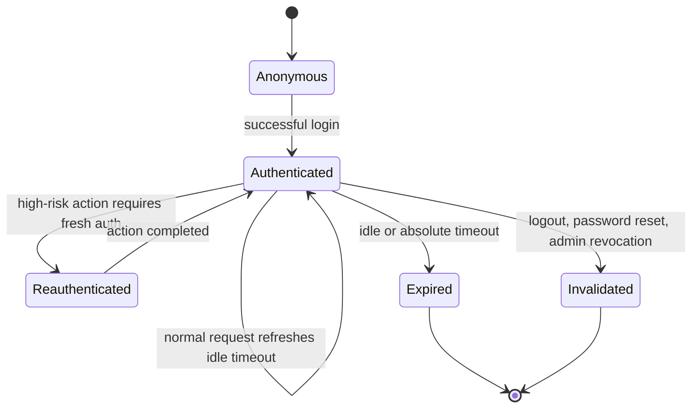

# Session Design

## Goals

- Keep session secrets server-side.
- Limit damage from stolen or stale sessions.
- Support RBAC privilege refresh after role or permission changes.
- Provide predictable timeout behavior for enterprise users.

## Session storage

| Item | Design |
|------|--------|
| Store | Redis via Spring Session |
| Cookie | `PORTALSESSION` by default |
| Cookie secrecy | HttpOnly; unavailable to JavaScript |
| Idle timeout | `SESSION_IDLE_TIMEOUT_MINUTES`, default placeholder 30 |
| Absolute timeout | `SESSION_ABSOLUTE_TIMEOUT_HOURS`, default placeholder 12 |
| CSRF | Session-bound token with Angular-readable CSRF cookie |

## Session lifecycle



## Rotation and invalidation

Rotate or invalidate sessions after:

- Login success.
- Password change or password reset.
- MFA enrollment, disablement, or recovery-code regeneration.
- Role or permission changes affecting the current user.
- Account disable, lock, or deletion.
- Logout.

## Privilege freshness

Each authenticated session stores or references an authorization version. When RBAC assignments change:

1. `accesscontrol` increments the affected user authorization version.
2. Existing sessions are refreshed or invalidated before the next privileged operation.
3. Authorization checks compare session version with the current version.

This prevents revoked permissions from persisting until session timeout.

## Cookie policy

Production cookie baseline:

```text
PORTALSESSION=...; HttpOnly; Secure; SameSite=Lax; Path=/
XSRF-TOKEN=...; Secure; SameSite=Lax; Path=/
```

Use `SameSite=Strict` only after validating password reset, email links, and any cross-site enterprise launch flows. Use `SameSite=None` only when a documented integration requires it and TLS is enforced.

## Concurrent sessions

Target policy:

- Allow a bounded number of concurrent sessions per user.
- Show active sessions in the user profile when implemented.
- Let users terminate other sessions.
- Let administrators terminate sessions for managed users with audit.

## Logging and telemetry

- Never log raw session IDs.
- Use generated request/correlation IDs for tracing.
- If session-level debugging is required, use one-way hashes with a rotating salt and restricted access.

## Open items

- Exact maximum concurrent sessions policy.
- Fresh-auth timeout for high-risk actions.
- Session management UI.
- Redis high-availability production topology.
