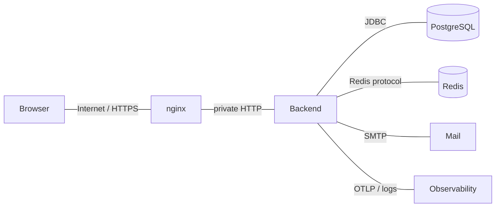

# Threat Model

## Scope

This STRIDE model covers the enterprise portal web application, backend modules, PostgreSQL, Redis sessions, email flows, audit trail, and observability outputs. It reflects the target design; individual controls remain **NOT VERIFIED** until implemented and tested.

## Assets

- User accounts, credentials, MFA factors, and recovery codes.
- Session identifiers and CSRF tokens.
- Roles, permissions, and administrative decisions.
- Audit hash chain and security events.
- Personal data such as email, display name, locale, timezone, and activity metadata.
- Operational secrets: database credentials, Redis credentials, MFA encryption keys, SMTP credentials.

## Trust boundaries

## STRIDE threats and controls

| STRIDE | Threat | Impact | Primary controls | Status |
|--------|--------|--------|------------------|--------|
| Spoofing | Credential stuffing against login | Account takeover | Argon2id, rate limiting, generic errors, MFA, security events | Planned |
| Spoofing | Session cookie theft through XSS or insecure transport | Account takeover | HttpOnly Secure cookies, CSP, TLS, no tokens in storage, session rotation | Planned |
| Spoofing | Password reset token replay | Account takeover | Hashed tokens, short TTL, one-time use, session revocation | Planned |
| Spoofing | MFA secret compromise | MFA bypass | Encrypt TOTP secrets, redact provisioning URI, recovery code hashing | Planned |
| Tampering | CSRF on administrative mutations | Unauthorized state change | Same-origin BFF, CSRF token header, SameSite cookies | Planned |
| Tampering | Role or permission escalation | Privilege escalation | Permission checks, final `SUPER_ADMIN` protection, audit, RBAC tests | Planned |
| Tampering | Audit record modification | Loss of evidence | Append-only DB privileges, hash chain, verifier job, backups | Planned |
| Tampering | Client-side manipulation of locale/theme/settings payloads | Invalid state or stored XSS | Server-side validation, allowlists, output encoding | Planned |
| Repudiation | Admin denies changing roles or users | Weak accountability | Actor/target audit events with correlation IDs and hash chain | Planned |
| Repudiation | Failed login or lockout not attributable | Poor incident response | Security events with privacy-preserving IP/user-agent hashes | Planned |
| Information disclosure | Secrets in application logs | Credential compromise | Logging standard, redaction filters, structured allowlist logging | Planned |
| Information disclosure | Actuator or OpenAPI exposed publicly | System reconnaissance | Network restrictions, admin auth, environment-specific exposure | Planned |
| Information disclosure | Overbroad dashboard aggregation | Privacy breach | Permission-scoped read models and tests | Planned |
| Denial of service | Login, reset, or MFA brute force floods | Account lockout or resource exhaustion | Rate limits, Redis counters, bounded payloads, monitoring | Planned |
| Denial of service | Large request bodies or expensive queries | Service degradation | nginx limits, validation, pagination, timeouts | Planned |
| Denial of service | Redis unavailable | Authentication disruption | Health checks, operational alerts, graceful failure modes | Planned |
| Elevation of privilege | Missing method-level authorization | Admin capability misuse | Deny-by-default, `hasAuthority`, authorization matrix tests | Planned |
| Elevation of privilege | Stale session authorities after RBAC changes | Revoked access continues | Authorization versioning and session privilege refresh | Planned |
| Elevation of privilege | Bootstrap credentials reused | Permanent backdoor | One-time bootstrap, audit, environment cleanup | Planned |

## Abuse cases

1. An attacker obtains a user's password and attempts repeated login from many IPs.
2. A lower-privileged administrator tries to grant themselves `ROLE_MANAGE` or `PERMISSION_MANAGE`.
3. A user crafts a CSRF form to disable another account while an admin is logged in.
4. An operator accidentally exposes `/actuator/prometheus` to the internet.
5. A bug writes raw reset tokens or MFA secrets to structured logs.
6. A database operator attempts to update or delete an audit row after a privileged action.

## Residual risks

- Cloud or deployment-specific TLS, WAF, and network controls are outside the repository until deployment manifests are implemented.
- Audit immutability depends on database privileges and backup retention policies being applied in production.
- MFA security depends on external key management and rotation procedures.
